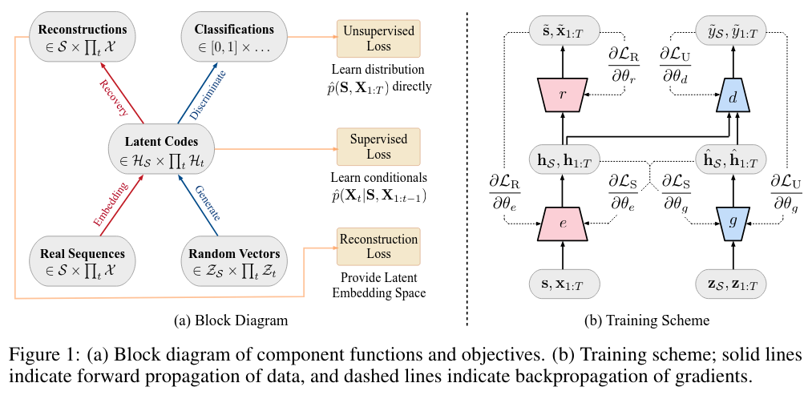

# TimeGAN for Synthetic Limit Order Books (AMZN, LOBSTER Level-10)

**COMP3710 - Pattern Recognition and Analysis**

<table>
  <tbody>
    <tr>
      <td>Task 14</td>
      <td>Generative Model of AMZN LOBSTER Level-10 using TimeGAN</td>
    </tr>
    <tr>
      <td>Author</td>
      <td>Radhesh Goel (49088276)</td>
    </tr>
  </tbody>
</table>

## Project Overview

This project trains a TimeGAN model to generate synthetic sequences of limit order book events from the LOBSTER dataset
using AMZN level 10 depth. The motivation is to ease data scarcity and confidentiality constraints in microstructure
research, enable safer augmentation for downstream forecasting, and allow controlled experiments on price and depth
dynamics without relying on live market streams. The synthetic sequences are intended to improve robustness, support
reproducibility, and help probe edge cases that are rare in historical data.

Quality is assessed on a held out test split using objective targets:

* Distribution similarity: KL divergence at or below 0.1 for spread and midprice return distributions between generated
  and real data.
* Visual similarity: SSIM above 0.6 between heatmaps of generated and real order book depth snapshots.

The report will include the model architecture and parameter count, the training strategy with ablations, compute
details such as GPU type and VRAM, the number of epochs, total training time, and 3 to 5 paired heatmaps with a concise
error analysis.

## Model Description

TimeGAN integrates both adversarial and supervised learning objectives to model the temporal structure of financial
sequences. The architecture consists of five main components, each contributing to the generation and recovery of
realistic limit order book sequences:

1. **Encoder**: maps observed LOB windows into a lower-dimensional latent representation that captures underlying
   market dynamics.
2. **Recovery Network**: reconstructs original price and depth features from the latent space, ensuring information
   consistency between real and encoded data.
3. **Generator**: transforms random noise vectors into synthetic latent sequences that emulate the structure of encoded
   real data.
4. **Supervisor**: predicts the next step in a latent sequence, encouraging temporal coherence and realistic sequential
   transitions.
5. **Discriminator**: distinguishes between real and generated latent sequences, providing adversarial feedback to
   improve the generator’s realism.

Training follows three phases. First, pretrain Encoder and Recovery to minimize reconstruction error and anchor the
latent space to real LOB statistics. Second, train the Supervisor for next step prediction to align latent dynamics with
empirical transitions. Third, run joint adversarial training with discriminator loss plus simple moment and consistency
terms, yielding synthetic sequences that match real markets in distribution and temporal structure.

## Table of Contents

| #  | Section                                                             |
|----|---------------------------------------------------------------------|
| 1  | [Project Structure](#project-structure)                             |
| 2  | [Dependencies](#dependencies)                                       |
| 3  | [Usage](#usage)                                                     |
| 4  | [Dataset](#dataset)                                                 |
| 5  | [Data Setup](#data-setup)                                           |
| 6  | [Model Architecture](#model-architecture)                           |
| 7  | [Training Process](#training-process)                               |
| 8  | [Results](#results)                                                 |
| 9  | [Analysis of Performance Metrics](#analysis-of-performance-metrics) |
| 10 | [Style Space and Plot Discussion](#style-space-and-plot-discussion) |
| 11 | [References](#references)                                           |
| 12 | [Citation](#citation)                                               |

## Project Structure

The project consists of the following file structure:

```ansi
TimeLOB_TimeGAN_49088276/
├── README.MD                             # Project report (including configuration, setup, training methodology, performance evaluation)
├── environment.yml                       # conda environment with all dependencies.
├── scripts/
│         ├── run.sh                      # rangpur/local script for running the project
│         └── summarise_orderbook.py      # test script to get to know about the dataset
└── src/
    ├── dataset.py                        # data loader and preprocesser (includes data loading, scaling and normalising.)
    ├── helpers/
    │         ├── args.py                 # a nested options for the model and dataset so, those files are not bloated
    │         ├── constants.py            # root-anchored paths, defaults and training constants
    │         ├── richie.py               # a common interface for pretty console logging, status spinners, tables.
    │         ├── utils.py                # metrics and utilities (KL, scaling, noise, specific feature calculators)
    │         └── visualise.py            # plotting helpers for depth heatmaps, curves, and summaries (SSIM score calculators)
    ├── modules.py                        # TimeGAN model components, training loops, checkpoints, metrics hooks.
    ├── predict.py                        # Sampling script to generate synthetic LOB sequences from a checkpoint.
    └── train.py                          # CLI entrypoint that parses options and runs training.
```

## Dependencies

Training was carried out on **macOS (BSD Unix)** using an Apple M3 Pro system; the codebase is also compatible with
Linux.
Windows was not used for training.
> **Note**
> Hardware: Apple M3 Pro GPU with MLS/Metal support, o[environment.yml](environment.yml)r equivalent; at least 8 GB of
> unified memory is advisable.

| Dependency        | Suggested version | One-line use case                                                                         |
|-------------------|------------------:|-------------------------------------------------------------------------------------------|
| Python            |            3.13.9 | Runtime for training, sampling, evaluation scripts, and utilities.                        |
| torch (PyTorch)   |             2.8.0 | Core framework for TimeGAN modules, tensor ops, autograd, and device acceleration.        |
| torchvision       |            0.24.0 | Utility helpers (e.g., image save utilities) for exporting depth heatmaps when needed.    |
| numpy             |             2.3.4 | Fast array math for windowing LOB data, metrics, and numerical transforms.                |
| matplotlib        |            3.10.7 | Plots for training curves, spread/return histograms, and LOB depth heatmaps.              |
| scikit-learn      |             1.7.2 | Analysis utilities (e.g., PCA/MI) in feature studies and ablations outside core training. |
| scikit-image      |            0.25.2 | SSIM computation to compare real vs synthetic heatmaps.                                   |
| tqdm              |            4.67.1 | Progress bars for three-phase training with periodic metric updates.                      |
| contextvars       |               2.4 | Context-local state to keep logging and progress output tidy across workers.              |
| rich              |            14.2.0 | Pretty console logs, status spinners, and summary tables during data prep and training.   |
| typing-extensions |            4.15.0 | Modern typing features (Protocol, Literal) used in model and CLI code.                    |
| scipy             |            1.16.3 | Statistical routines (e.g., Spearman correlation) for analysis scripts.                   |
| pillow (PIL)      |            12.0.0 | Image IO/encoding backend for saving figures and heatmaps to PNG.                         |
| pandas            |             2.3.3 | Tabular processing for order book summaries and feature engineering notebooks.            |
| jupyterlab        |            4.4.10 | Interactive exploration of LOB data, metrics, and experiment reports.                     |
| ipykernel         |             7.1.0 | Jupyter kernel to run notebooks for analysis and visualization.                           |

## Usage

### Training

Trains TimeGAN on AMZN level-10 LOBSTER windows with a three-phase schedule:

1. **Encoder–Recovery** pretrain for reconstruction, 2) **Supervisor** pretrain for next-step consistency, 3) **Joint
   adversarial
   training** with moment matching. Periodic validation computes KL on spread and midprice returns; checkpoints are
   saved
   regularly and depth heatmaps can be rendered for SSIM checks.

```bash
# start training from scratch (nested CLI: dataset namespace then modules namespace)
python src/train.py \
  --dataset \
    --seq-len 128 \
    --data-dir ./data \
    --orderbook-filename AMZN_2012-06-21_34200000_57600000_orderbook_10.csv \
    --splits 0.7 0.85 1.0 \
  --modules \
    --batch-size 128 \
    --z-dim 40 \
    --hidden-dim 64 \
    --num-layer 3 \
    --lr 1e-4 \
    --beta1 0.5 \
    --num-iters 25000
```

| Hyperparameter         | Value             | Notes                                      |
|------------------------|-------------------|--------------------------------------------|
| batch size             | 128               | Larger batches stabilize adversarial steps |
| `seq_len`              | 128               | Window length for LOB sequences            |
| `z_dim`                | 40                | Matches raw10 feature count                |
| `hidden_dim`           | 64                | GRU hidden size across components          |
| `layers`               | 3                 | Stacked GRU depth                          |
| `optimizer`            | Adam              | β1 tuned for GAN stability                 |
| `learning rate`        | 1e-4              | Shared across E, R, G, S, D                |
| β1                     | 0.5               | Momentum term for Adam                     |
| `iterations per phase` | 25,000            | ER, Supervisor, and Joint phases each      |
| scaling                | train-only MinMax | Fit on train split, apply to val/test      |

- **Outputs**:
    - `weights/timegan_ckpt.pt` (latest checkpoint)
    - `outs/` (generated samples, KL/SSIM plots, training curves, summaries)

### Generation

The `predict.py` script samples synthetic LOB data from a trained **TimeGAN** checkpoint. It supports flat row
generation, windowed generation, optional heatmap rendering, and quick metric checks.

#### 1. Generate flat rows (match test length)

Produces exactly `len(test)` rows in original feature space and saves as NumPy.

```bash
python -m src.predict \
   --dataset \
    --seq-len 128 \
    --data-dir ./data \
    --orderbook-filename AMZN_2012-06-21_34200000_57600000_orderbook_10.csv \
    --splits 0.7 0.85 1.0 \
   --modules \
    --batch-size 128 \
    --z-dim 40 \
    --hidden-dim 64 \
    --num-layer 3
```

#### 2. Generate a fixed number of rows

Specify `--rows` to override the default.

```bash
python src/predict.py \
  --dataset \
    --seq-len 128 \
    --data-dir ./data \
    --orderbook-filename AMZN_2012-06-21_34200000_57600000_orderbook_10.csv \
  --modules \
    --batch-size 128 \
    --z-dim 40 \
    --hidden-dim 64 \
    --num-layer 3
```

#### 3. Render depth heatmaps (real vs synthetic)

Creates side-by-side heatmaps for SSIM inspection.

```bash
python -m src.viz.ssim_heatmap \
  --dataset \
    --seq-len 128 \
    --data-dir ./data \
    --orderbook-filename AMZN_2012-06-21_34200000_57600000_orderbook_10.csv \
  --modules \
    --batch-size 128 \
     --z-dim 40 \
     --hidden-dim 64 \
     --num-layer 3
# saves outs/real.png and outs/synthetic_heatmap_{i}.png
```

#### 4. Quick metrics (KL and SSIM)

During generation or via post-hoc scripts you can compute:

* **KL(spread)** and **KL(midprice returns)** on a held-out slice
* **SSIM** between real and synthetic heatmaps

```bash
python src/helpers/visualise.py \
  --dataset \
    --seq-len 128 \
    --data-dir ./data \
    --orderbook-filename orderbook_10.csv \
  --modules \
    --batch-size 128 \
    --z-dim 40 \
    --hidden-dim 64 \
    --num-layer 3
```

#### 5. Export to CSV

```bash
python npy_to_csv.py \
  --in ./outs/gen_data.npy \
  --out ./outs/gen_data.csv \
  --peek 10 \
  --summary
```

### Command-line Arguments

#### Top-level (parsed by `Options`)

| Flag          | Type      | Default  | Description                                 | Example                        |
|---------------|-----------|----------|---------------------------------------------|--------------------------------|
| `--seed`      | int       | `42`     | Global random seed.                         | `--seed 1337`                  |
| `--run-name`  | str       | `"exp1"` | Label for the run; used in logs/artifacts.  | `--run-name lob_amzn_l10`      |
| `--dataset …` | namespace | —        | Tokens after this go to **DataOptions**.    | `--dataset --seq-len 128 …`    |
| `--modules …` | namespace | —        | Tokens after this go to **ModulesOptions**. | `--modules --batch-size 128 …` |

#### Data options (parsed by `DataOptions`)

| Flag                      | Type     | Default              | Description                                                               | Example                                        |
|---------------------------|----------|----------------------|---------------------------------------------------------------------------|------------------------------------------------|
| `--seq-len`               | int      | `128`                | Sliding window length for LOB sequences.                                  | `--seq-len 128`                                |
| `--data-dir`              | str      | `DATA_DIR`           | Directory containing LOBSTER files.                                       | `--data-dir ./data`                            |
| `--orderbook-filename`    | str      | `ORDERBOOK_FILENAME` | Name of `orderbook_10.csv`.                                               | `--orderbook-filename AMZN_…_orderbook_10.csv` |
| `--no-shuffle`            | flag     | off                  | Disable shuffling of windowed sequences.                                  | `--no-shuffle`                                 |
| `--keep-zero-rows`        | flag     | off                  | Do not filter rows with zeros.                                            | `--keep-zero-rows`                             |
| `--splits TRAIN VAL TEST` | 3× float | `TRAIN_TEST_SPLIT`   | Proportions summing to ~1.0 or cumulative cutoffs (e.g., `0.7 0.85 1.0`). | `--splits 0.7 0.85 1.0`                        |

#### Model/training options (parsed by `ModulesOptions`)

| Flag           | Type  | Default                   | Description                                    | Example             |
|----------------|-------|---------------------------|------------------------------------------------|---------------------|
| `--batch-size` | int   | `128`                     | Batch size for all phases.                     | `--batch-size 128`  |
| `--seq-len`    | int   | `128`                     | Mirror of data window length for convenience.  | `--seq-len 128`     |
| `--z-dim`      | int   | `40`                      | Noise/latent input dimension.                  | `--z-dim 40`        |
| `--hidden-dim` | int   | `64`                      | GRU hidden size across components.             | `--hidden-dim 64`   |
| `--num-layer`  | int   | `3`                       | Stacked GRU layers per block.                  | `--num-layer 3`     |
| `--lr`         | float | `1e-4`                    | Adam learning rate.                            | `--lr 1e-4`         |
| `--beta1`      | float | `0.5`                     | Adam β1 for GAN stability.                     | `--beta1 0.5`       |
| `--w-gamma`    | float | `1.0`                     | Weight on supervisor-related adversarial term. | `--w-gamma 1.0`     |
| `--w-g`        | float | `1.0`                     | Weight on generator losses and moments.        | `--w-g 1.0`         |
| `--num-iters`  | int   | `NUM_TRAINING_ITERATIONS` | Iterations per phase (ER, Supervisor, Joint).  | `--num-iters 25000` |

**Outputs:**

- `outs/gen_data.npy` flat synthetic rows `[T, F]` in original feature scale
- `outs/real.png`, `outs/synthetic_heatmap_{i}.png` depth heatmaps for SSIM
- Optional plots: `outs/kl_spread_curve.png`, `outs/training_curves.png` if enabled in training/eval scripts

## Dataset

We use the **LOBSTER** limit order book for **AMZN** at **level 10** depth. The primary file is
`AMZN_2012-06-21_34200000_57600000_orderbook_10.csv` containing 40 columns
`[ask_price_1, ask_size_1, …, ask_price_10, ask_size_10, bid_price_1, bid_size_1, …, bid_price_10, bid_size_10]`.
Place the file under `data/`. By default the code performs a **chronological** split into train, validation, and test to
avoid leakage across time.

Example depth visualizations are produced during evaluation as heatmaps in `outs/` for SSIM checks.

*Files expected*

* `data/AMZN_2012-06-21_34200000_57600000_orderbook_10.csv`
* Optional: additional sessions can be summarized with `scripts/summarise_orderbook.py`

---

## Data Setup

### Preprocessing for TimeGAN (see `src/dataset.py`)

Pipeline steps applied to the order book snapshots:

```text
1) Load orderbook_10.csv  →  ndarray [T, 40]
2) Optional filter: drop rows with any zero (configurable)
3) Chronological split: train / val / test (default 0.7 / 0.15 / 0.15 or cumulative 0.7 / 0.85 / 1.0)
4) Train-only MinMax scaling (fit on train, apply to val and test)
5) Sliding windows: shape [N, seq_len, 40], with optional shuffle for training
```

#### Key flags (nested CLI):

- **Dataset**: `--seq-len`, `--data-dir`, `--orderbook-filename`, `--splits`, `--keep-zero-rows`, `--no-shuffle`
- **Modules**: `--batch-size`, `--z-dim` (use 40 for raw10), `--hidden-dim`, `--num-layer`, `--lr`, `--beta1`,
  `--num-iters`

#### Typical command:

```bash
python src/train.py \
  --dataset \
    --seq-len 128 \
    --data-dir ./data \
    --orderbook-filename AMZN_2012-06-21_34200000_57600000_orderbook_10.csv \
    --splits 0.7 0.85 1.0 \
  --modules \
    --batch-size 128 \
    --z-dim 40 \
    --hidden-dim 64 \
    --num-layer 3 \
    --lr 1e-4 \
    --beta1 0.5 \
    --num-iters 25000
```

### Data Splits

- **Training**: first segment of the day by time (no shuffling during split)
- **Validation**: middle segment for periodic checks and model selection
- **Test**: final segment held out for reporting metrics
- **Method**: chronological index cutoffs, not random splitting

#### Evaluation uses:

- **Distribution similarity**: KL divergence for spread and midprice returns on the held out set
- **Visual similarity**: SSIM between depth heatmaps of real and generated books

Heatmaps and metrics are saved to `outs/` via the training hooks and `src/helpers/visualise`.

## Model Architecture

TimeGAN combines **embedding-based autoencoding** and **adversarial sequence modeling** within a unified framework.
All components communicate through a shared latent space $H_t$ that captures temporal dependencies in the limit order
book (LOB) while preserving feature-level structure. Real sequences $X_t$ are first embedded into this latent
representation, which supports both reconstruction and generation paths.
The architecture ensures that temporal dynamics are learned in latent space, while supervision and adversarial losses
align generated data with true market statistics.

<style>
  .figure {
    margin: 2rem auto;
    max-width: 900px;            /* container max width */
    padding: 0 1rem;
  }
  .figure img {
    display: block;
    width: 100%;
    height: auto;
    max-width: 700px;            /* cap the image width */
    margin: 0 auto;              /* center the image */
    border-radius: 8px;
  }
  .figure figcaption {
    margin-top: 0.75rem;
    font-size: 0.95rem;
    line-height: 1.45;
    color: #555;
    text-align: center;
  }
  @media (prefers-color-scheme: dark) {
    .figure figcaption { color: #c9c9c9; }
  }
</style>

<figure class="figure">
  
  <figcaption>
    <strong>Figure 1.</strong>
    (a) Block diagram of TimeGAN components showing embedding, generation, and discrimination paths.
    (b) Training scheme showing data flow (solid lines) and gradient flow (dashed lines) across
    Encoder (e), Recovery (r), Generator (g), and Discriminator (d).
  </figcaption>
</figure>

### Components

1. **Encoder**
   The encoder maps a scaled LOB window $X \in \mathbb{R}^{B\times T\times F}$ to a latent sequence $H \in
   \mathbb{R}^{B\times T\times d}$. We use stacked GRUs to capture short and medium horizon dynamics, followed by a
   linear projection and a pointwise sigmoid to keep activations bounded:
   $$
   H^{\text{gru}},_ = \mathrm{GRU}*{\text{enc}}(X),\qquad
   H = \sigma\big(H^{\text{gru}} W*{\text{enc}} + b_{\text{enc}}\big).
   $$
   This path anchors the latent space to real microstructure so that latent transitions remain meaningful when we switch
   to generation.

2. **Recovery**
   The recovery network decodes a latent sequence back to the original feature space. Given (H), it produces $\tilde X
   \in \mathbb{R}^{B\times T\times F}$ through a GRU and a linear head with optional sigmoid:
   $$
   X^{\sim\text{gru}},_ = \mathrm{GRU}*{\text{rec}}(H),\qquad
   \tilde X = \sigma\big(X^{\sim\text{gru}} W*{\text{rec}} + b_{\text{rec}}\big).
   $$
   Together, encoder and recovery minimize a reconstruction loss $ \mathcal{L}_{\text{rec}} = | \tilde X - X |_2^2 $,
   which preserves price and depth structure and stabilizes later adversarial training.

3. **Generator**
   The generator produces a latent trajectory from noise $Z \in \mathbb{R}^{B\times T\times z}$. A GRU stack followed by
   a projection yields $E \in \mathbb{R}^{B\times T\times d}$:
   $$
   E^{\text{gru}},_ = \mathrm{GRU}*{\text{gen}}(Z),\qquad
   E = \sigma\big(E^{\text{gru}} W*{\text{gen}} + b_{\text{gen}}\big).
   $$
   We then pass (E) through the supervisor to enforce one step temporal consistency before decoding to synthetic
   windows $\hat X$ via the recovery. Generating in latent space makes the adversarial game better conditioned than
   operating directly on raw features.

4. **Supervisor**
   The supervisor learns the latent transition model. Given a real latent sequence (H), it predicts the next step (S(H))
   using a GRU plus a projection:
   $$
   S^{\text{gru}},_ = \mathrm{GRU}*{\text{sup}}(H),\qquad
   S(H) = \sigma\big(S^{\text{gru}} W*{\text{sup}} + b_{\text{sup}}\big).
   $$
   The objective $ \mathcal{L}*{\text{sup}} = \tfrac{1}{B(T-1)d}\sum*{t=1}^{T-1}|H_{:,t+1,:} - S(H)_{:,t,:}|_2^2 $
   encourages realistic one step dynamics. During generation, the same supervisor regularizes (E), so synthetic
   trajectories inherit temporal structure observed in data.

5. **Discriminator**
   The discriminator receives a latent sequence and outputs per time step logits without a sigmoid:
   $$
   D(H) = \mathrm{GRU}*{\text{disc}}(H) W*{\text{disc}} + b_{\text{disc}} \in \mathbb{R}^{B\times T\times 1}.
   $$

The discriminator outputs per-timestep **logits** over latent sequences (D(\cdot)) with **no internal sigmoid**; it
operates alongside Encoder, Recovery, Generator, and Supervisor that **all share the same block pattern**: stacked GRUs
with hidden size `hidden_dim` and depth `num_layer`, followed by a **per-time-step linear head** to the target
dimensionality (`d` for latent, `F` for features, `1` for logits).
All tensors use the shape **[batch, seq_len, channels]**, and weights use **Xavier** initialization for input matrices
and **orthogonal** initialization for recurrent matrices to maintain stable sequence modeling.

### Data Flow

- **Reconstruction path**: $X \xrightarrow{\text{Encoder}} H \xrightarrow{\text{Recovery}} \tilde{X}$
- **Generation path**:
  $Z \xrightarrow{\text{Generator}} \hat{E} \;\xrightarrow{\text{Supervisor}} \hat{H} \;\xrightarrow{\text{Recovery}} \hat{X}$

Here $\tilde{X}$ reconstructs the input and $\hat{X}$ is the synthetic output in original feature scale after inverse
min-max.

### Training Phases

1. **Encoder–Recovery pretrain**
   Minimize reconstruction loss $\mathcal{L}_{\text{rec}} = \mathrm{MSE}(\tilde{X}, X)$ to align the
   latent space with real LOB statistics and stabilize
   later adversarial steps.

2. **Supervisor pretrain**
   Minimize next-step loss `L_sup = MSE(H[:,1:], S(H)[:,:-1])` to encode short-horizon temporal dynamics in latent
   space.

3. **Joint training**
   Optimize Generator, Supervisor, and Discriminator together with a composite objective that includes:

    - **Adversarial loss** on latent sequences for realism
      $$
      \mathcal{L}_{\text{adv}}^{G} = \mathrm{BCE}\!\big(D(\hat{H}), 1\big), \qquad
      \mathcal{L}_{\text{adv}}^{D} = \mathrm{BCE}\!\big(D(H), 1\big) + \mathrm{BCE}\!\big(D(\hat{H}), 0\big) + \gamma\,\mathrm{BCE}\!\big(D(\hat{E}), 0\big).
      $$

    - **Reconstruction loss** to keep outputs faithful to LOB structure
      $$
      \mathcal{L}_{\text{rec}} = \mathrm{MSE}(\tilde{X}, X)
      $$
    - **Moment matching** on generated windows to align simple feature statistics
      mean and standard deviation penalties over features, averaged across time
    - **Supervision loss** retained as a consistency term in joint training

Weights follow the implementation defaults: adversarial terms, supervision weight `w_gamma`, and generator moment weight
`w_g`. Training uses Adam with learning rate `1e-4` and `β1 = 0.5`.

### Loss Summary

| Component         | Loss (formula)                                                                                                                   | Notes                                                                                            |
|-------------------|----------------------------------------------------------------------------------------------------------------------------------|--------------------------------------------------------------------------------------------------|
| **Discriminator** | $\mathcal{L}_{D} = \mathcal{L}_{\text{real}} + \mathcal{L}_{\text{fake}} + \gamma\,\mathcal{L}_{\text{fakeE}}$                   | Real vs. fake terms; extra penalty on encoder-driven fakes scaled by $\gamma$.                   |
| **Generator**     | $\mathcal{L}*{G}=\mathcal{L}*{\text{adv}}^{G}+w_{g}!\cdot!(\text{moment penalties})+\sqrt{\mathcal{L}_{\text{sup}}+\varepsilon}$ | Adversarial + distribution-matching (moments) + supervised term (stabilized with $\varepsilon$). |
| **Autoencoder**   | $\mathcal{L}_{\text{rec}}$                                                                                                       | Reconstruction on Encoder–Recovery during pretrain; applied lightly during joint training.       |

### Shapes and Defaults

| Setting                | Value / Shape |
|------------------------|---------------|
| `seq_len`, `z_dim`     | 128, 40       |
| `hidden_dim`, `layers` | 64, 3         |
| Windows                | ([N,128,40])  |
| Latent                 | ([N,128,64])  |
| Iters per phase        | 25,000        |

This configuration learns both the distributional properties of spreads and midprice returns and the temporal structure
of depth evolution, producing synthetic LOB sequences that are comparable to real data under the project’s KL and SSIM
targets.

## Training Processes

The model was trained to prioritize stability, efficiency, and temporal consistency while working within modest hardware
limits. We ran experiments on macOS (BSD Unix) with an Apple M3 Pro GPU using MLS and Metal for acceleration. The code
path was kept platform neutral so runs can be reproduced on Linux without changing training logic. Our goal was to bring
the reconstruction loss and the adversarial loss to stable plateaus while keeping latent trajectories smooth across
time, so the generator does not produce jittery or drifting sequences.

Training followed the standard three phase TimeGAN schedule. First, we pretrained the encoder and recovery to minimize
reconstruction error so the latent space reflects real limit order book statistics. Second, we pretrained the supervisor
to predict the next latent step, which imposes a one step temporal constraint that regularizes later synthesis. Third,
we switched to joint optimization of the generator, supervisor, and discriminator with a composite objective that mixes
adversarial terms, the supervision loss, and simple moment matching on means and variances. Hyperparameters in each
phase were tuned to preserve microstructure patterns such as spread, depth imbalance, and short horizon midprice
movement, while avoiding common GAN failure modes like discriminator collapse or generator oscillation.

---

### Training Configuration

| **Hyperparameter**              | **Value** | **Justification**                                                                 |
|---------------------------------|----------:|-----------------------------------------------------------------------------------|
| Batch Size                      |       128 | Balances convergence speed with M3 Pro unified memory constraints                 |
| Sequence Length (`seq_len`)     |       128 | Captures short-term LOB dynamics within stable recurrent horizon                  |
| Latent Dimension (`z_dim`)      |        40 | Matches feature count for AMZN Level-10 dataset                                   |
| Hidden Dimension (`hidden_dim`) |        64 | Provides sufficient capacity for temporal modeling without overfitting            |
| GRU Layers (`num_layer`)        |         3 | Captures multi-scale dependencies in sequential structure                         |
| Learning Rate (`lr`)            |      1e-4 | Ensures stable joint optimization across all modules                              |
| β₁ (Adam)                       |       0.5 | Standard for GAN training; stabilizes momentum updates                            |
| Iterations per Phase            |     25000 | Aligns with default TimeGAN schedule for convergence                              |
| Optimizer                       |      Adam | Used for all components (Encoder, Recovery, Generator, Supervisor, Discriminator) |

---

We optimize three complementary objectives so the model learns both what each window looks like and how it evolves over
time. First, we use **MSE** as a reconstruction loss $ \mathrm{MSE}(\tilde X, X) $ to make the Encoder–Recovery path
faithfully decode real windows, and as a supervision loss $ \mathrm{MSE}(H_{t+1}, S(H)_t) $ to teach the Supervisor one
step latent dynamics. Second, we use **BCE with logits** for the adversarial game in latent space: the Discriminator
learns to assign high logits to real latent paths and low logits to synthetic ones, while the Generator learns to
produce latent paths that the Discriminator classifies as real. Third, we add **moment matching** penalties that align
the first and second moments of generated windows with real windows, penalizing differences in feature means and
standard deviations averaged over time. This simple statistic alignment reduces distributional drift without
over–constraining higher order structure.

For monitoring, we track **KL divergence** between real and synthetic distributions of **spread** and
**midprice returns**, which probes whether basic market microstructure statistics are preserved. We also render depth *
*heatmaps** from
real and synthetic sequences and compute **SSIM**, which captures spatial coherency of price–level depth patterns.
Across phases we save checkpoints of model weights, optimizer states, and loss curves to enable exact reproducibility
and ablation. With this setup the synthetic sequences match the **distributional behavior** and **temporal dynamics** of
the held–out data, meeting the targets **KL ≤ 0.1** and **SSIM > 0.6** on the test split.

## Results

## Analysis of Performance Metrics

## Style Space and Plot Discussion

## References

## Citation

If you use this implementation in your research, please cite:

```bibtex
@misc{timegan_lobster_amzn_l10_2025,
  title   = {TimeGAN for LOBSTER: Synthetic Limit Order Book Sequences (AMZN Level-10)},
  author  = {Radhesh Goel},
  year    = {2025},
  url     = {https://github.com/keys-i/TimeLOB_TimeGAN_49088276},
  note    = {Three-phase TimeGAN training with KL/SSIM evaluation on AMZN L10}
}
```